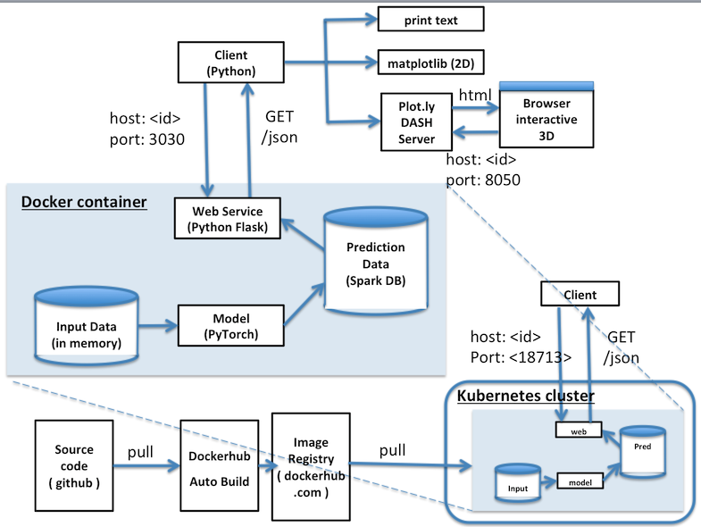
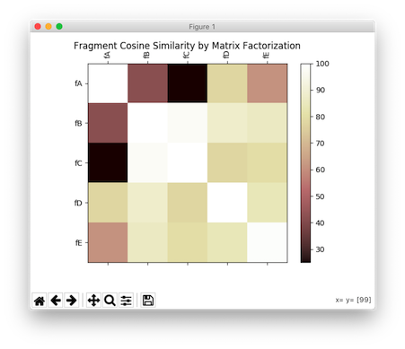
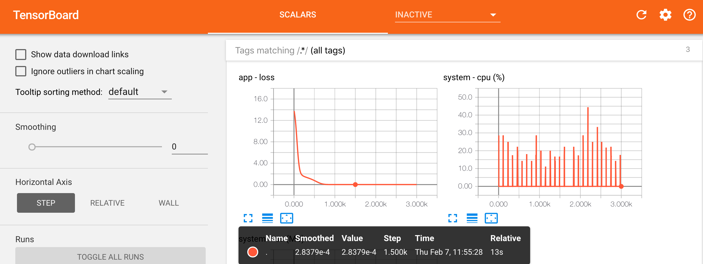
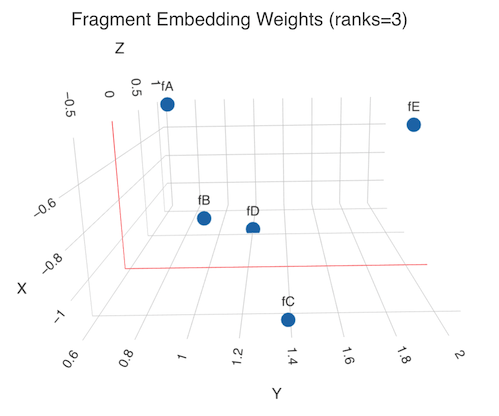
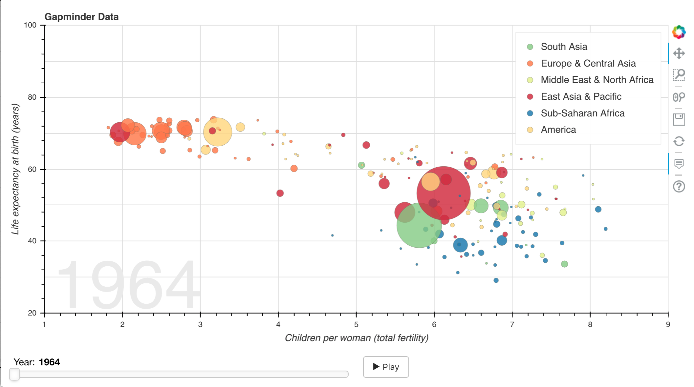
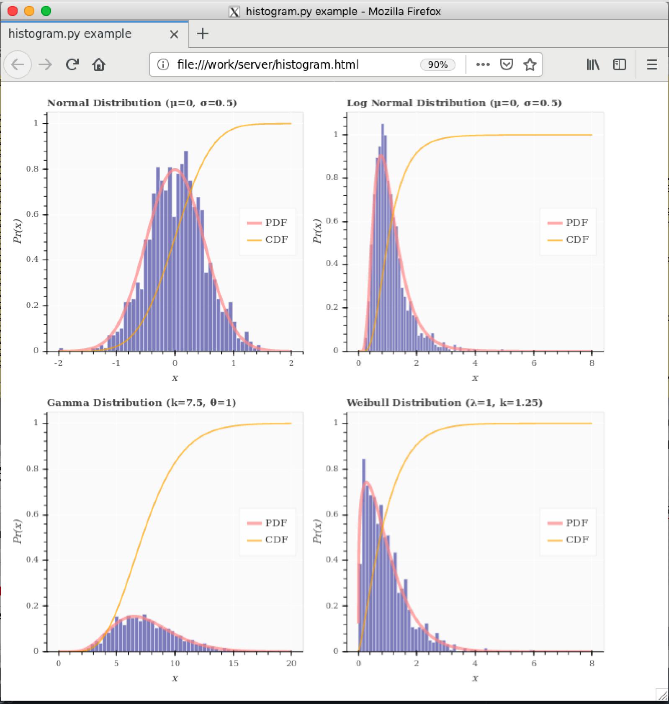

# Container as Portable Dev Environment

We can think of  container as a **portable development environment**.  Code and data are managed with version control system (VCS) such as Github and Bitbucket.  We pull them to local repository and mounted to the container as external volumes.  In software development work-flow, the VCS is integrated with CI&CD infrastructure for test, build, deployment and documentation.  The code and data are mounted/unmounted to the container as needed.  The ntdemo container is the portable development environment for deep learning work flow.

The ntdemo docker image contains one set of DL framework (PyTorch), data base (Spark), and visualization tools (matplotlib, bokeh, plotly/dash).  We can pick and choose any DL framework, data base and visualization packages and build another container image.  We can even create a variety of containers for a variety of development work-flows, e.g., Nodejs, PostgreSQL and React for frontend work, or RDBMS and No-SQL databases with statistical packages for data science work-flows.

What about hardware?  We can run the container not only on laptop but on the cloud with many different configurations - memory size, network speed, storage capacity, GPU, etc.  We can put local docker image storage on DISK1, github local repositories on DISK2, and data sets on DISK3 and mount them to compute resource as needed.  For example, I run the container on CPU of my laptop for initial prototyping.  For training with terabytes of production dataset, I use the same container on the cloud with GPU.  The training speed is 10x of laptop at $1 per hour.  10 hours vs. 1 hour; 10x productivity gain for $1, not bad.

The productivity/cost is manageable as we wish.  `ntdemo2` container is capable of running all those scenarios.

We've got a lot to cover.  Let's start.

# Ntdemo Container Functionality

* Client/Server in Python and Flask
* Data pipeline with Spark
* [Matrix factorization model using PyTorch](#matrix-factorization-model-training)
* [Enable GPU access inside the container](#enable-gpu-access-inside-the-container)
* [Chatbot Model Training on GPU and CPU](#chatbot-model-training-on-gpu-and-cpu)
* Export the model to ONNX
* Visualize with [matplotlib(2D)](#figure-showing-the-similarity-of-five-fragments-in-percentage) and [Plotly/Dash(interactive 3D)](#show-fragment-factor-weights-in-3d)
* Containerize with Docker and Dockerhub
* Manage the container w/ Kubernetes
* [Run bokeh server in container](#run-bokeh-server-in-container)
* [Draw from matplotlib in container to MacOS host display](#draw-from-matplotlib-in-container-to-macos-host-display)
* Appendix: [Chemical fragment functional similarity model](#appendix-chemical-fragment-similarity)




## Quick Start

### (1) Install ntdemo from Docker Hub

```shell
docker pull setogit/ntdemo2
docker run -p 3030:3030 -p 8050:8050 -t setogit/ntdemo2
```
This `curl` is useful to quickly check if the server is up and running:
```shell
curl http://0.0.0.0:3030/cosine/score
```
Please note that it will take a few minutes to train a [Chemical Fragment Similarity](#appendix-chemical-fragment-similarity) model at start-up.  You can also see 3D interactive visualization of the similarity at `0.0.0.0:8050` on your browser.  We'll discuss [the model training](#matrix-factorization-model-training) and [the 3D visualization](#show-fragment-factor-weights-in-3d) later.

### (2) Chatbot deep learning model

The container includes another model: chatbot.  It's pre-trained.  Open a separate terminal window and run three command lines:
```shell
sudo docker exec -it <container id> bash
```
then, inside the container:
```shell
cd /work/chatbot
python chatbot.pyc
```
in 10 sec, it'll be ready.  
```shell
You can start chatting or "q" to quit.
> hi
Bot: hi how d your day go ?
> good. what is your name?
Bot: my name is sir robin of camelot !
> how old are you, sir?
Bot: twenty eight .
> do you drink?
Bot: no .
> 
```
We'll discuss [more about the chatbot in GPU section](#chatbot-model-training-on-gpu-and-cpu).

### (3) Install ntdemo client from Github

<a href="https://github.com/Setogit/ntdemo/blob/master/matrixfactorization_drug_discovery_client.py" target="_blank">The client code</a> calls [REST API](#rest-api) and visualizes the functional similarity of each fragment-fragment pair.
```shell
git clone https://github.com/Setogit/ntdemo.git

cd ntdemo
python matrixfactorization_drug_discovery_client.py
```
#### Figure showing the similarity of five fragments in percentage


### (Optional) Add the container to Kubernetes cluster

```shell
cd ntdemo/manifests
kubectl apply -f demo_server_deployment.yaml --record
kubectl apply -f demo_server_service.yaml
```

Note that `matrixfactorization_drug_discovery_*.py` reads the host and the port from `NTDEMO_HOST` and `NTDEMO_PORT` environment variables.

## Matrix Factorization Model Training

The model is to minimize the mean square error between the ground truth value and a dot product of the two predicted fragment factor vectors.  The factor matrices are implemented as PyTorch `Embedding`.  The training process converges in 1,000 iterations/10 seconds as shown below since our current data set is very small (5 fragments x 10 targets).  The ntdemo service runs the training at the start-up time.



## Re-train with custom data set

[The fragment similarity map](#figure-showing-the-similarity-of-five-fragments-in-percentage) is built from the default data set built in the service:
```shell
    default_data = {
      "fragment_comp": {
        # Compounds are made of Fragments
        #           C O M P O U N D S
        #      c0,c1,c2,c3,c4,c5,c6,c7,c8,c9
        'fA': [1, 0, 0, 0, 0, 1, 0, 0, 1, 0], # fragment name fA
        'fB': [0, 0, 1, 0, 1, 0, 1, 0, 0, 0], # fragment name fB
        # fB is contained in compound 2, 4, and 6
        'fC': [1, 0, 1, 0, 0, 0, 1, 0, 0, 1], # fragment name fC
        # fC is contained in compound 0, 2, 6, and 9
        'fD': [0, 0, 1, 0, 0, 1, 1, 0, 1, 0], # fragment name fD
        'fE': [0, 1, 0, 1, 1, 0, 1, 0, 1, 1], # fragment name fE
      },
      # Compounds interact with Protein Targets
      "comp_target_interaction": [
        #       T A R G E T S
        #t0,t1,t2,t3,t4,t5,t6,t7,t8,t9  # COMPOUNDS
        [1, 0, 0, 0, 0, 1, 0, 1, 0, 0], # compound 0
        [1, 0, 0, 0, 0, 1, 0, 1, 0, 0], # compound 1
        [1, 0, 1, 0, 1, 0, 0, 1, 1, 0], # compound 2
        [0, 1, 0, 0, 0, 1, 0, 0, 0, 1], # compound 3
        [0, 0, 0, 1, 0, 0, 1, 0, 1, 0], # compound 4
        [1, 0, 0, 0, 0, 0, 0, 1, 1, 0], # compound 5
        [1, 1, 0, 1, 1, 0, 0, 1, 1, 1], # compound 6
        [0, 0, 1, 0, 0, 0, 1, 0, 0, 0], # compound 7
        [0, 1, 0, 0, 0, 0, 1, 1, 1, 0], # compound 8
        [0, 0, 0, 1, 1, 0, 0, 1, 0, 1], # compound 9
      ]
    }
```
It's easy to customize the data set and retrain the model, e.g., `/Users/user/ntdemo/asset/data.json` we git-cloned in [the quick start step](#3-install-ntdemo-client-from-github).  To retrain the model using the `data.json`, we start the container with `docker run -v` option to mount `/Users/user/ntdemo/asset` to `/data` in the container.  At start-up time, the ntdemo server looks for `/data/data.json` and runs the training with the data set.  If it's not found, the default data set is used.
```shell
docker run -v /Users/user/ntdemo/asset/:/data -p 3030:3030 -p 8050:8050 -t setogit/ntdemo2
```
Note that the `data.json` is on your local disk.  To retrain the model with more complex data set, you can modify `data.json` and restart the container.

## REST API

The ntdemo service supports a `GET` method.

```shell
METHOD: GET
PATH: /cosine/score
PARAMS: None

RETURNS: fragment names and cosine scores as an object
```

**Request**:
```shell
curl http://<host>:<port>/cosine/score
```

**Returns**:
```js
{
  "names": ["fA", "fB", "fC", "fD", "fE"],
  "scores": [
    [100.0, 42.0, 25.0, 78.0, 61.0],
    [42.0, 100.0, 98.0, 88.0, 86.0],
    [25.0, 98.0, 100.0, 78.0, 80.0],
    [78.0, 88.0, 78.0, 100.0, 84.0],
    [61.0, 86.0, 80.0, 84.0, 99.0]
  ]
}
```
The cosine scores are shown in [the 5x5 map](#figure-showing-the-similarity-of-five-fragments-in-percentage).

## Serving from Spark Backing Store

[Fragment Similarity matrix](#figure-showing-the-similarity-of-five-fragments-in-percentage) is saved in Spark backing store.  It is read from the backing store every time the REST API is called.

## Show Fragment Factor Weights in 3D

You can visualize the model parameters learned in the train run by `python ntdemo/matrixfactorization_drug_discovery_client.py 1`.  For example, the 3-D parameters for the 5 fragments look like the following:
```js
[(-0.43629, 0.61818,  1.09134),
 (-0.83396, 1.01726, -0.21356),
 (-1.11781, 1.38727, -0.64068),
 (-1.14348, 1.20169,  0.53775),
 (-0.48097, 2.06527,  0.22856)]
```
First, [the 2D map](#figure-showing-the-similarity-of-five-fragments-in-percentage) is displayed.  After you close the 2D map, the Plotly Dash server will start at `0.0.0.0:8050`.  You can check out the interactive 3D on your browser.

Note that the model is trained outside of the container.  All the dependent packages need to exist on your local environment.

It is possible to [install ntdemo client from github](#3-install-ntdemo-client-from-github) and run the client code inside the container, then, draw on the host's display via X11 as we cover in [this section](#draw-from-matplotlib-in-container-to-macos-host-display).



## Run bokeh server in container

```shell
docker run -v /Users/user/ntdemo/asset/:/data -p 3030:3030 -p 8050:8050 -p 5006:5006 -t setogit/ntdemo2 bash bokeh.sh
```
The `setogit/ntdemo2` container includes more than `spark` and `pytorch`.  `openjdk` is required by `spark`, so it's in there.  For visualization, `matplotlib` and <a href="https://bokeh.pydata.org/en/latest/" target="_blank">bokeh</a> are included.  Other numerical packages such as `numpy`/`scipy` and `pandas` are included in the container as well.

To run bokeh examples, `docker run` the container with `setogit/ntdemo2 bash bokeh.sh`.  Once the `bokeh` server is started, see how it's displayed with your browser: `http://0.0.0.0:5006` or `http:localhost:5006`

## Running on the cloud

First, please make sure ports: 3030, 8050, and 5006 are externally accessible.

In case of running the container on the cloud, the `bokeh` server does not accept requests from anybody but localhost.  Mitigation is to `ssh` into your host on the cloud, access into the container: `sudo docker exec -it <container id> bash`, and restart the `bokeh` server in the container with `allow-websocket-origin` option as follows:
```shell
python -c "import bokeh.sampledata; bokeh.sampledata.download()"
bokeh serve --allow-websocket-origin=<host name>:5006 --show /work/server/bokeh_examples/gapminder/
```
For example, on AWS, it looks like:
```
bokeh serve --allow-websocket-origin=ec2-15-236-153-130.us-west-1.compute.amazonaws.com:5006 --show bokeh_examples/gapminder/
```
See how it's displayed with your browser: `https://<host name>:5006`



## Draw from matplotlib in container to MacOS host display

Local (non-web-based) GUI packages like `matplotlib` can draw images from inside the ntdemo container on the container host's display using X11 server. Here is the step to set up the X11 server on MacOS.  When the setup is successfully done, small X11 server window will show up on the Mac screen.
```shell
Need to install socat and XQuartz first:
1. brew install socat
2. brew cask install xquartz
3. logoff then logon to MacOS
4. From XQuartz Preferences, check "Allow connections from network clients" under Security tab.
5. After all installed,

 > IP=$(ifconfig en0 | grep inet | awk '$1=="inet" {print $2}')
 > socat TCP-LISTEN:6000,reuseaddr,fork UNIX-CLIENT:\"$DISPLAY\" &
 > open -a XQuartz && xhost + $IP
```
Then, restart the container.  [The Fragment Similarity figure (matplotlib drawing)](#figure-showing-the-similarity-of-five-fragments-in-percentage) will be displayed on Mac display in X11 window:

```
docker run -e DISPLAY=$IP:0 -v /tmp/.X11-unix:/tmp/.X11-unix -p 3030:3030 -p 8050:8050 -p 5006:5006 -t setogit/ntdemo2
```

To run a non-server bokeh app on the server side, `docker exec -it <docker id> bash` from another terminal.  Under `/work/server` directory in the container, run these two lines:
```
python -c "import bokeh.sampledata; bokeh.sampledata.download()"
python bokeh_examples/histogram.py
```
You can run any *.py script under `/work/server/bokeh_examples` this way.  Note that the `bokeh` example *.py draws in `firefox` which is running inside the container.  The GUI app (firefox) is shown on the host display via X11.

References:
    <a href="https://blog.alexellis.io/linux-desktop-on-mac/" target="_blank">Bring Linux apps to the Mac Desktop with Docker</a>, 
    <a href="https://cntnr.io/running-guis-with-docker-on-mac-os-x-a14df6a76efc" target="_blank">Running GUI with Docker on Mac OS X</a>



## Enable GPU access inside the container

PyTorch training can be accelerated in case GPU is available on the host.  The `ntdemo2` docker image contains PyTorch and required packages such as CUDA Tool 10.0.130 to access Nvidia GPU on the host.

On the host side, you need to install **nvidia-docker2** to enable GPU access.  `--runtime=nvidia` is required.
```shell
nvidia-docker2 run --runtime=nvidia -p 3030:3030 -p 8050:8050 -t setogit/ntdemo2
```
Nvidia-docker2 supports Linux platforms only.  Details are <a href="https://github.com/NVIDIA/nvidia-docker">here</a>.  On AWS, nvidia-docker2 is pre-installed as `docker` on GPU-enabled EC2 instances.  Note that since multiple versions of CUDA are pre-installed and 9.0 is the default, we need to manually switch to 10.0:
```shell
sudo rm /usr/local/cuda
sudo ln -s /usr/local/cuda-10.0 /usr/local/cuda

sudo docker run --runtime=nvidia -p 3030:3030 -p 8050:8050 -t setogit/ntdemo2
```
**Deep Learning Base AMI (Amazon Linux) Version 16.2** AMI and **g3s.xlarge** EC2 instance are used.  Run `nvcc` or `nvidia-smi` inside the container to verify the GPU access:
```shell
# show the CUDA toolkit version
nvcc -V

root@d8f3219703fc:/work# nvcc -V
nvcc: NVIDIA (R) Cuda compiler driver
Copyright (c) 2005-2018 NVIDIA Corporation
Built on Sat_Aug_25_21:08:01_CDT_2018
Cuda compilation tools, release 10.0, V10.0.130
```

```shell
# show the GPU status
nvidia-smi

root@d8f3219703fc:/work# nvidia-smi

+-----------------------------------------------------------------------------+
| NVIDIA-SMI 410.79       Driver Version: 410.79       CUDA Version: 10.0     |
|-------------------------------+----------------------+----------------------+
| GPU  Name        Persistence-M| Bus-Id        Disp.A | Volatile Uncorr. ECC |
| Fan  Temp  Perf  Pwr:Usage/Cap|         Memory-Usage | GPU-Util  Compute M. |
|===============================+======================+======================|
|   0  Tesla M60           On   | 00000000:00:1E.0 Off |                    0 |
| N/A   54C    P8    15W / 150W |      0MiB /  7618MiB |      0%      Default |
+-------------------------------+----------------------+----------------------+

+-----------------------------------------------------------------------------+
| Processes:                                                       GPU Memory |
|  GPU       PID   Type   Process name                             Usage      |
|=============================================================================|
|  No running processes found                                                 |
+-----------------------------------------------------------------------------+

```
You can also run a short PyTorch code:
```shell
python -c "import torch; print(torch.cuda.is_available())"
```
The output should be `True`.  Caveat: PyTorch 1.0 does not run on `g2.2xlarge` EC2 instance due to `old_gpu_warn`.

## Chatbot Model Training on GPU and CPU

The second model example built in the `ntdemo2` container is chatbot (English and Japanese) which is a modified version of <a href="https://pytorch.org/tutorials/" target="_blank">the tutorial</a> provided by the PyTorch team.  It's <a href="https://arxiv.org/abs/1506.05869" target="_blank">seq2seq model with attention</a>.

The inference/evaluation (single run) is fast enough on CPU, but for training, GPU helps a lot to run millions of iterations.  For example, the chatbot training on `g3s` EC2 instance with `Tesla M60` GPU takes less than one hour.  On MacBook Pro CPU, it takes 10 hours for 30000 iterations.

```shell
root@0c0b3f286a39:/work/chatbot# python chatbot.pyc -h

python chatbot.pyc <LANGUAGE> <ITERATIONS>

   LANGUAGE: String: "JA" for Japanese or "EN" for English (default: EN)
   ITERATIONS: Integer: Number of iterations to run training
   pre-trained EN : 29000 iterations
               JA : 25000 iterations

Examples:
   python chatbot.py    : chat in English
   python chatbot.py JA : chat in Japanese
   python chatbot.py JA 28000 : train Japanese chatbot from the pre-trained (25000 iterations) till 28000 iterations, then chat in Japanese
   python chatbot.py EN 28000 : chat in English because pre-trained to 29000 

```
Here is a dialogue between human (>) and the Japanese chatbot (Bot:) after 25000 training iterations.

```shell
チャットを始めてください。"q"を入力すれば終了します。
> うまくいってる？
Bot: そう な ん だ
> へー
Bot: 行け ば
> どこに？
Bot: 頭 に
> 頭？
Bot: 頭 弱い
> あ、痛いのか。
Bot: うん わかっ て ない ん じゃ ない の ー
> わからないよ。
Bot: わから ない
> うん。
Bot: ふーん
> 頭、痛かったんじゃないの。
Bot: どれ だっ た
> 頭。
Bot: 頭 弱い
> あ、弱いのか。は、は、は。
Bot: うん 今週 の 安く さ ー
> 何が、安いの。
Bot: ここ に ある やつ 安い 方 あり
> だから、何が安いのさ。
Bot: そう それ は なんか その 方 が
> どれ？
Bot: これ ああ そう ふわふわ それ 去年 の
> 何？
Bot: 聞け て ない
> え、聞いてない？
Bot: うん 自慢 し なきゃ あの
> 自慢するのは、ほどほどにしないとね。
Bot: うん よかっ た
> 明日、何するの？
Bot: もう いい と 思う
> わかった。
Bot: あー
> 休む
Bot: うん
> お休み
Bot: うん
> また、明日。
Bot: また あれ たら
> どこで
Bot: 駅前 な ｂ 2 駅前 で
> どこの
Bot: え えーと
> 宇都宮
Bot: うん
> q
```

## Feature/Task Items

|  | Low | Mid | High |
| --- | --- | --- | --- |
| Data Source | [x] in-memory/file | [x] local DB | remote DB |
| Presentation | [x] print text | [x] local matplotlib | [x] browser Plotly/D3.js |
| Deployment | [x] git | [x] docker/dockerhub | [x] kubernetes |

- [x] PyTorch matrix factorization model and training
- [x] local visualization (matplotlib?)
- [x] refactor to client/server
- [x] containerize the server and push to Dockerhub
- [x] kubernetes orchestration
  - kubernetes manifest yaml to manage the container in k18s cluster
- [x] PLOTLY visualization
  - use PLOTLY for 3D visualization in local mode only
- [x] Spark DB
  -  store the sample data set to Spark and ntdemo server reads from there
- [x] Separate the model/training code to a common module 
- [x] Dockerhub auto build
- [x] PyTorch export to ONNX
- [ ] ~~ONNX import to PyTorch~~  (ONNX import not supported by PyTorch yet)
- [x] Run bokeh server in container
- [x] Draw from matplotlib in container to MacOS host display
- [x] Enable GPU access inside the container
- [x] Integrate chatbot (pre-trained English)
- [x] Integrate chatbot (pre-trained Japanese)

## Appendix: Chemical Fragment Similarity

> *Can we predict latent functional similarity between Chemical fragments ?*
> 
> Idea: Chemical compounds are made of smaller parts (fragments). The compounds interact with protein targets when a drug alleviates a disease.  Hypothesis is that there might be some correlation at fragment level in case two compounds are known to alleviate a certain disease.  Compounds-targets activities are directly observable, but fragments-targets are not.  Given the protein activity data observed in in-vivo tests, can we predict the latent mechanism at fragment level?  If two compounds show different side effects, can we explain the mechanism at fragment level?

## Revision History

* 1.0.0 Initial release  setogit@gmail.com
* 2.0.0 Support data set customization with data.json  setogit@gmail.com
* 2.1.0 Matplotlib and bokeh server running in container  setogit@gmail.com
* 2.1.1 Plotly Dash and Bokeh servers running in container on cloud  setogit@gmail.com
* 2.1.2 (ntdemo2) Enable GPU access inside the container  setogit@gmail.com
* 2.1.3 (ntdemo2) Add chatbot examples