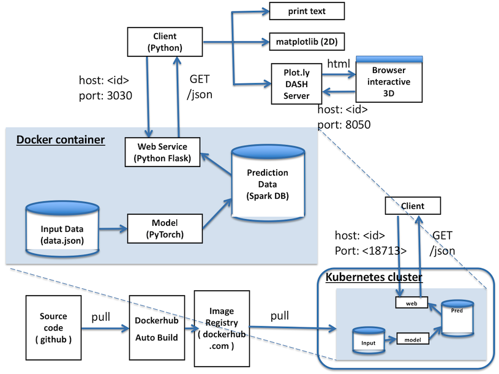

# ntdemo

This app covers:
* Client/Server in Python and Flask
* Data pipeline with Spark
* [Matrix factorization model using PyTorch](#matrix-factorization-model-training)
* Export the model to ONNX
* Visualize with matplotlib(2D) and Plotly/Dash(interactive 3D)
* Containerize the server w/ Docker and Dockerhub
* Manage the container w/ Kubernetes
* [Run bokeh server in container](#run-bokeh-server-in-container)
* [Draw from matplotlib in container to MacOS host display](#draw-from-matplotlib-in-container-to-macos-host-display)

> *Can we predict latent functional similarity between Chemical fragments ?*
> 
> Idea: Chemical compounds are made of smaller parts (fragments). The compounds interact with protein targets when a drug alleviates a disease.  Hypothesis is that there might be some correlation at fragment level in case two compounds are known to alleviate a certain disease.  Compounds-targets activities are directly observable, but fragments-targets are not.  Given the protein activity data observed in in-vivo tests, can we predict the latent mechanism at fragment level?  If two compounds show different side effects, can we explain the mechanism at fragment level?

#### ntdemo services architecture


## Quick Start

### (1) Install ntdemo server from Docker Hub

```shell
docker pull setogit/ntdemo
docker run -p 3030:3030 -p 8050:8050 -t setogit/ntdemo
```
It will take a few minutes for ntdemo service to train the prediction/recommender model at start-up.  We get to the model training [here](#matrix-factorization-model-training).  To quickly check if the server is running in the container:
```shell
curl http://0.0.0.0:3030/cosine/score
```
You can also see 3D interactive accessing `0.0.0.0:8050` on your browser.  We'll discuss [the 3D visualization with Plotly Dash later](#show-fragment-factor-weights-in-3d).

### (2) Install ntdemo client from Github

The client code polls the prediction result and visualizes the functional similarity of each fragment-fragment pair.
```shell
git clone https://github.com/Setogit/ntdemo.git

cd ntdemo
python matrixfactorization_drug_discovery_client.py
```
#### fragment similarity


### (Optional) Customize fragment/compound/target data set

The fragment similarity map is built from the default data set built in the service:
```shell
    default_data = {
      "fragment_comp": {
        # Compounds are made of Fragments
        #           C O M P O U N D S
        #      c0,c1,c2,c3,c4,c5,c6,c7,c8,c9
        'fA': [1, 0, 0, 0, 0, 1, 0, 0, 1, 0], # fragment name fA
        'fB': [0, 0, 1, 0, 1, 0, 1, 0, 0, 0], # fragment name fB
        # fB is contained in compound 2, 4, and 6
        'fC': [1, 0, 1, 0, 0, 0, 1, 0, 0, 1], # fragment name fC
        # fC is contained in compound 0, 2, 6, and 9
        'fD': [0, 0, 1, 0, 0, 1, 1, 0, 1, 0], # fragment name fD
        'fE': [0, 1, 0, 1, 1, 0, 1, 0, 1, 1], # fragment name fE
      },
      # Compounds interact with Protein Targets
      "comp_target_interaction": [
        #       T A R G E T S
        #t0,t1,t2,t3,t4,t5,t6,t7,t8,t9  # COMPOUNDS
        [1, 0, 0, 0, 0, 1, 0, 1, 0, 0], # compound 0
        [1, 0, 0, 0, 0, 1, 0, 1, 0, 0], # compound 1
        [1, 0, 1, 0, 1, 0, 0, 1, 1, 0], # compound 2
        [0, 1, 0, 0, 0, 1, 0, 0, 0, 1], # compound 3
        [0, 0, 0, 1, 0, 0, 1, 0, 1, 0], # compound 4
        [1, 0, 0, 0, 0, 0, 0, 1, 1, 0], # compound 5
        [1, 1, 0, 1, 1, 0, 0, 1, 1, 1], # compound 6
        [0, 0, 1, 0, 0, 0, 1, 0, 0, 0], # compound 7
        [0, 1, 0, 0, 0, 0, 1, 1, 1, 0], # compound 8
        [0, 0, 0, 1, 1, 0, 0, 1, 0, 1], # compound 9
      ]
    }
```
It's easy to customize the data set and retrain the model, e.g., `/Users/user/ntdemo/asset/data.json` we git-cloned in the step (2).  To retrain the model using the `data.json`, we start the container with `docker run -v` option to mount `/Users/user/ntdemo/asset` to `/data` in the container.  At start-up time, the ntdemo server looks for `/data/data.json` and runs the training with the data set.  If it's not found, the default data set is used.
```shell
docker run -v /Users/user/ntdemo/asset/:/data -p 3030:3030 -p 8050:8050 -t setogit/ntdemo
```
Note that the `data.json` is on your local disk.  It's also accessible inside the container memory space.  To retrain the model with your data set, you can modify `data.json` and restart the container.  

### (Optional) Add the container to Kubernetes cluster

```shell
cd ntdemo/manifests
kubectl apply -f demo_server_deployment.yaml --record
kubectl apply -f demo_server_service.yaml
```

Note that `matrixfactorization_drug_discovery_*.py` reads the host and the port from `NTDEMO_HOST` and `NTDEMO_PORT` environment variables.

## Matrix Factorization Model Training

The model is to minimize the mean square error between the ground truth value and a dot product of the two predicted fragment factor vectors.  The factor matrices are implemented as PyTorch `Embedding`.  The training process converges in 1,000 iterations/10 seconds as shown below since our current data set is very small (5 fragments x 10 targets).  The ntdemo service runs the training at the start-up time.


## Serving from Spark Backing Store

[Fragment Similarity matrix](#fragment-similarity) is stored to Spark backing store.  It is served from the Spark backing store every time the REST API is called.

## REST API

The ntdemo service supports a `GET` method.  The ntdemo client calls this API when `GET_METRICS_FROM_SERVER = True` and visualizes the cosine similarity.

```shell
METHOD: GET
PATH: /cosine/score
PARAMS: None

RETURNS: fragment names and cosine scores as an object †
```

† see below example

### Example Request:
```shell
curl http://<host>:<port>/cosine/score
```

**Returns**:
```js
{
  "names": ["fA", "fB", "fC", "fD", "fE"],
  "scores": [
    [100.0, 42.0, 25.0, 78.0, 61.0],
    [42.0, 100.0, 98.0, 88.0, 86.0],
    [25.0, 98.0, 100.0, 78.0, 80.0],
    [78.0, 88.0, 78.0, 100.0, 84.0],
    [61.0, 86.0, 80.0, 84.0, 99.0]
  ]
}
```
The cosine scores are shown in the 5x5 map.

## Show Fragment Factor Weights in 3D

You can visualize the model parameters learned in the train run by `python ntdemo/matrixfactorization_drug_discovery_client.py 1`.  For example, the 3-D parameters for the 5 fragments look like the following:
```js
[(-0.43629, 0.61818,  1.09134),
 (-0.83396, 1.01726, -0.21356),
 (-1.11781, 1.38727, -0.64068),
 (-1.14348, 1.20169,  0.53775),
 (-0.48097, 2.06527,  0.22856)]
```
First, the 2D map is displayed.  After you close the 2D map, the Plotly Dash server will start at `0.0.0.0:8050`.  Go ahead and check out the interactive 3D figure on your browser.

Please note that the model is trained in the local memory space inside the client using your local `/data/data.json`.  The ntdemo server will not be affected.


## Run bokeh server in container

```shell
docker run -v /Users/user/ntdemo/asset/:/data -p 3030:3030 -p 8050:8050 -p 5006:5006 -t setogit/ntdemo bash bokeh.sh
```
The `setogit/ntdemo` container includes more than `spark` and `pytorch`.  As shown in the `Dockerfile`, `openjdk` is required by `spark`, so it's in there.  For visualization, `matplotlib` and <a href="https://bokeh.pydata.org/en/latest/" target="_blank">bokeh</a> are included.  Other numerical packages such as `numpy`/`scipy` and `pandas` are included as well.

To run an bokeh example, `docker run` the container with `setogit/ntdemo bash bokeh.sh`.  Once the `bokeh` server is started, see how it's displayed with your browser: `http://0.0.0.0:5006`


## Draw from matplotlib in container to MacOS host display

Local (non-web-based) GUI packages like `matplotlib` can draw images from inside the ntdemo container on the container host's display using X11 server. Here is the step to set up the X11 server on MacOS.  When the setup is done, small X11 server window will show up on the Mac scree.  You can safely close the window.
```shell
Need to install ocat and XQuartz first:
1. brew install socat
2. brew cask install xquartz
3. logoff then logon to MacOS
4. From XQuartz Preferences, check "Allow connections from network clients" under Security tab.
5. After all installed,

 > IP=$(ifconfig en0 | grep inet | awk '$1=="inet" {print $2}')
 > socat TCP-LISTEN:6000,reuseaddr,fork UNIX-CLIENT:\"$DISPLAY\" &
 > open -a XQuartz && xhost + $IP
```
Then, restart the container.  The Fragment Similarity figure (matplotlib drawing) will be displayed on Mac display in X11 window:

```
docker run -e DISPLAY=$IP:0 -v /tmp/.X11-unix:/tmp/.X11-unix -p 3030:3030 -p 8050:8050 -p 5006:5006 -t setogit/ntdemo
```

To run a non-server bokeh app on the server side, `docker exec -it <docker id> bash` from another terminal.  Under `/work/server` directory in the container, run these two lines:
```
python -c "import bokeh.sampledata; bokeh.sampledata.download()"
python bokeh_examples/histogram.py
```
You can run any *.py script under `/work/server/bokeh_examples` this way.  Note that the `bokeh` example *.py draws in `firefox` which is running inside the container.  The GUI (firefox) is drawn on the host display via X11.

References:
    <a href="https://blog.alexellis.io/linux-desktop-on-mac/" target="_blank">Bring Linux apps to the Mac Desktop with Docker</a>, 
    <a href="https://cntnr.io/running-guis-with-docker-on-mac-os-x-a14df6a76efc" target="_blank">Running GUI with Docker on Mac OS X</a>


## Feature/Task Items

|  | Low | Mid | High |
| --- | --- | --- | --- |
| Data Source | [x] in-memory/file | [x] local DB | remote DB |
| Presentation | [x] print text | [x] local matplotlib | [x] browser Plotly/D3.js |
| Deployment | [x] git | [x] docker/dockerhub | [x] kubernetes |

- [x] PyTorch matrix factorization model and training
- [x] local visualization (matplotlib?)
- [x] refactor to client/server
- [x] containerize the server and push to Dockerhub
- [x] kubernetes orchestration
  - kubernetes manifest yaml to manage the container in k18s cluster
- [x] PLOTLY visualization
  - use PLOTLY for 3D visualization in local mode only
- [x] Spark DB
  -  store the sample data set to Spark and ntdemo server reads from there
- [x] Separate the model/training code to a common module 
- [x] Dockerhub auto build
- [x] PyTorch export to ONNX
- [ ] ~~ONNX import to PyTorch~~  (ONNX import not supported by PyTorch yet)
- [x] Run bokeh server in container
- [x] Draw from matplotlib in container to MacOS host display

## Revision History

* 1.0.0 Initial release  setogit@gmail.com
* 2.0.0 Support data set customization with data.json  setogit@gmail.com
* 2.1.0 Matplotlib and bokeh server running in container  setogit@gmail.com
* 2.1.1 Plotly Dash server running in container  setogit@gmail.com